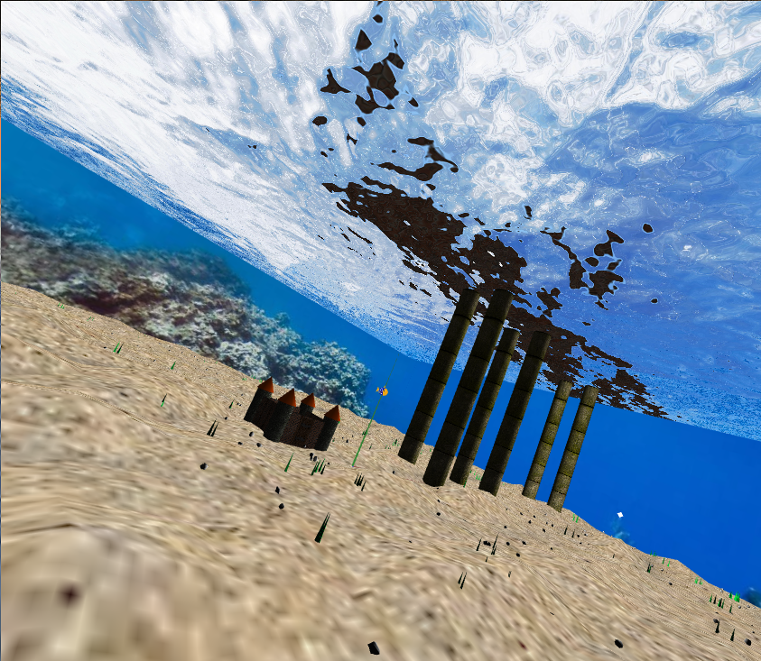

# CGRA 2020/2021

## Group T04G02

## Project Notes

### Part 1

- We created a class vector3 to help us organize our data and code better
- We tried to implement a realistic movement system. For this, we created an auxiliary variable that measures the update interval time in seconds. Then, instead of applying directly oldPosition + velocity, we use oldPosition + deltaTime\*velocity, simulating the formula x = v\*t. By calling checkKeys on update, we can also update the object velocity and rotation with deltaTime, simulating v = a\*t and angle = w\*t. We also added some items relative to this, such as acceleration (units² / 2), max velocity (units / s) and rotation velocity (deegrees / s)..
- When the 'W' or 'S' keys are pressed we want to start accelerating at that exact update period. To do this we record the acceleration of the previous frame, if it was zero then velocity stays the same, if it is non zero and current acceleration is non zero then this means that either the 'W' or 'S' keys were pressed on the last update and so velocity should be updated.
- We added an aditional movement option which is drag. Under Scene Physics, this value can be tweaked and toggled.

### Part 2

#### Cube

- Some transformation matrices were applied in order to invert the cube inside out, the majority of them was a mirror around the YZ
- We added some cube maps
  - [Space cubemap generated randombly using this website](https://wwwtyro.github.io/space-3d/)
  - [Mountain cubemap](http://www.humus.name/index.php?page=Cubemap&item=Ryfjallet)
- Sometimes these cubemaps would have a line on the corners, so we scaled every face of the cube on every axis by 1.001 factor.

#### Cylinder

- To build the cylinder we generated vertices, normals, faces and defined texture coordinates. For this to work, we used a variable number of slices and calculated the angle increment in each step. The vertices had the positions r\*v(cos(θ), 0, sin(θ)) and r\*v(cos(θ), h, sin(θ)) and the normals were n(cos(θ), 0, sin(θ)), according to the Gouraud Smooth Shading method. Finally, to correctly have a texture built into the cylinder, we had to create 2 extra vertices, at the same position of the first 2 vertices, so that the first vertex would have coordinates 0 and 1. We also added a gui entry to controll the number of slices of the cylinder.

#### Sphere

- The sphere has texture coordinates as follows:
  - 0,0 to 1,0 in the north pole. In the top of the sphere, we will find multiple vertices.
  - 0,1 to 1,1 in the south pole. In the bottom of the sphere, we will find multiple vertices.
  - According to the code of the sphere, it will create the vertices iterating through the s coordinates of the texture for each iteration of the t coordinates (longitude over each latitude).
- All we did in this part was to push to the texCoords array the values the percentage of longitude and latitude visited in each iteration of the double for loop. This means that after adding a vertex to the vertices array, we pushed the values longitude/this.longDivs and latitude/this.latDivs to the texCoords array.

### Part 3

#### Additional controls

- Some controls were already in effect in previous version of the code such as selection of the cubemap textures. That option is under Skybox folder.
- We created the scale factor controller which was placed under Vehicle folder. For this, we simply added a scaleFactor variable in the controllable class and applied the scaling transformation matrix. This matrix must be the first one in the transformations chain, therefore it appears right before display.
- We also added the scene speed controllable under Scene Physics folder. For this matter, we had to create some auxiliary variables. We were already using a function `updateDeltaTime`. As explained before, delta time is the time between update calls. This is used to get an accurate representation of units per second in movement physics. We refactored this function by modifying and creating new variables:
  - fixedLastUpdate, which indicates the last real `t` value. This variable is extremely important to calculate the real time between updates, otherwise this would be affected over and over again by the speed factor.
  - lastPhysicsUpdate, which indicates the last `t` value affected by time factor. In the future, instead of passing t to the animations, we shall use this `lastPhysicsUpdate`, since it is affected by the time factor. We tested with the water shader animation example, passing the value `lastPhysicsUpdate` instead of `t` and the speed of the vehicle and sphere animation are working accordingly to the speedFactor.
- With this new variables, we can do some important calculations:
  - lastDelta is now affected by timeFactor: (t - this.lastFixedUpdate)/1000 \* this.speedFactor. This affects the controllable object movement.
  - lastPhysicsUpdate is calculated with this.lastPhysicsUpdate + this.lastDelta. Since lastDelta is affected by timeFactor, so will lastUpdate.
  - lastFixedUpdate is the current timetamp `t`. This is always the real value without being affected by timeFactor.
- Throughout the project we changed the UI folder structure to be more clean and understandable.
  - Created vehicle folder with parameters like acceleration, max velocity, rotation speed and its size.
  - In the cylinder folder we can update its properties, like the number of slices.
  - Under Scene Physics we added drag coefficient and a checkbox to activate and deactivate this simulation option. The speed factor of the scene is also located in this folder.
  - All of the checkboxes related to choosing what objects to render are located under Display Scene Objects.
  - Under Skybox folder, the skybox's texture can be chosen, as previously said.

### Part 4

- To create the fish, we used a sphere to serve as a body. The orientation chosen was the z-Axis as the front facing direction of the fish. The sphere used had a radius of 1 unit, therefore we had to normalize it dividing by 2. After this, we scaled the spehere according to the parameters of the constructor. Later we had to rotate the sphere so that the axis connecting poles would be parallel to the z-Axis, so that the texture closes on the front and back part, and not in the top and bottom, which looked strange. After this, we separated the tails and wings in different animated classes, so that in the future it is easier to animate and controll them. We applied transformations according to the scale and position parameters, so that the fish has the wings, eyes, tail and head in the correct place, no matter those values.
- Because CGF disables sending the texture coordinates to the vertex shaders if a texture is not set (via the appearance applied for example) we set the scene.activeTexture to any texture to bypass that restriction.
- Fish Texture from https://gumroad.com/juliosillet?sort=page_layout#ufEtG
- The shader used for the body is being also used to the rest of the fish, by setting an uniform boolean value indicating if the texture should be drawn or only the color.
- We created a simple eye by using a shader, painting black near the top of the sphere.
- To enable animations, we created a class `MyRotationAnimatedObject`.The two derived classes `MyAnimatedWing` and `MyAnimatedTail` work the same way in terms of updating the rotation, so it made sense to use a parent class that `update` worked the same way, according to some variables like minimum and maximum rotation and its speed, which can be set in the constructor. This value is updated using the previously explained variable `lastDelta` so that animation speed is controlled by the whole scene speed.

### Part 5

- We created a simple castle using cubes, spheres and cylinders to serve as the fish's nest. Instead of a radius, the nest's area is calculated by the castle's wall length.

#### Sand surface shader

- The sand surface is a MyPlane object which has its face turned to the Z positive axis. This is the reason why the shader changes the vertice's Z position when using the displacement map. The sand surface is shifted to its correct position using matrix transformations.
- To make it so the sand surface doesn't rise when using the displacement map (and when updating the max displacement using the interface) we use the red value of the displacement texture, multiply by 2 and remove 1. This effectively changes the displacement interval from [0, 1] to [-1, 1], keeping the middle values on z=0. After that, we multiply by the uDisplacement uniform variable to change the interval to [-uDisplacement, uDisplacement].
- To implement the restriction that the floor can't exceed a certain Y max value, which is passed by parameter and changeable through the interface, we used a conditional checking if after displacing the vertex its Z coordinate (Z not Y since MyPlane is facing +Z) was higher than the max value, setting it back if it is. At first we would apply the same conditional on the negative Z axis, however we changed it to check if it was lower than 0 so as to not have floating objects.
- To merge the colors of the displacement map and the sand texture we used a variable, split, that would represent the percentage of the sand texture in the blend, making 1.-split the percentage of the displacement texture.
- The split variable is calculated using the red value of the displacement map and multiplied by a constant, changeable through the interface, uTextureBlend. We use the red value of the displacement texture because this makes the split variable closer to 1 (giving more weight to the sand texture) in the more white areas of the displacement texture. This makes the darker areas of the displacement texture more visible and the whiter areas less visible, keeping the sand texture as unchanged as possible.

#### Water surface shader

- To create this shader, we created a simple mathematical function, a linear regression, `offset=m*x+b`, where m is (upperLim - lowerLim) / 1.0 and b = lowerLim. This creates a line where the domain x[0,1] returns distortion\*[-0.5,0.5] (the offset). This distortion variable can be controlled in the interface.
- We noticed that the shader would not behave well if the offset + the current texture position would exceed the limits. We tested and found that subtracting (or summing if the calculated position result was less than 0) the remaining. For example if the calculated result was texture position 1.2, we would subtract the remainder (0.2), meaning that the result would be 0.8.

#### Rocks

- To build the rocks, we used a random function between values. We had a problem where the rock was not being closed. This was happening because the last vertex was having a different random value from the first vertex. This problem was was solved by storing the first vertex of each iteration through the stacks, so that the last longitude value would be the same vertex.
- The rock set class generates random rocks with random values, like position and rotation, and receives some values. One of them is the forbidden area (which should be the nest) where no rock will be placed.

#### Pillars

- Texture from https://texturehaven.com/tex/?t=wooden_rough_planks

#### New Cubemap

- Texture from https://scontent.fopo2-2.fna.fbcdn.net/v/t31.18172-8/12309485_566273546856505_7486047898896512292_o.jpg?_nc_cat=106&ccb=1-3&_nc_sid=e3f864&_nc_ohc=b7xYMOhVz90AX_amnWn&_nc_ht=scontent.fopo2-2.fna&oh=610683026c446f0af60699e2553ae3f0&oe=60B637AD

#### Algae

- Algae are generated in groups. Just like the rocks, their positions are generated and can't spawn in the forbidden area. However, in each position, a random number of algae from 1 to 5 are generated around that position in an area of a square of 0.2 units width.

### Part 6

#### Animations

- Controlling the animation of the back tail was easy to achieve, since we only needed to send the speed factor, speed/maxSpeed.
- Controlling the side fins was however quite tricky. We introduced a state variable that indicated which rotation the fish was performinig (LEFT, RIGHT) or FORWARD, if not rotating. When the rotation states were applied, we had to stop rotating the respective fin. To do this, we introduced 2 variables, rRotVel and lRotVel, whose job was to indicate if the corresponding fin should move or not. For example, when LEFT state was applied, this variable would be 0.
- To guarantee that the fins were synchronized after rotating the fish, we needed to make sure that a stopped fin waited for the other to be in the same rotation as them. To acomplish this, there were 2 situations:
  - When a fin stops rotating, its respective velocity will be 0 until the other fin has the some rotation. After this, the corresponding rotVel with be set to 1 again, and the directions and angle will be set.
  - With this, we found that if we rotated left and right too quickly the fins would wait for each other, stopping forever. To solve this issue, after each state rotation state change we switched the velocity of the other fin to be 1. Because of this, when the fish starts rotating left and right, the fins will alternate.

#### Rock Pick-up

- To search for the nearest rock, a linear search is used.
- When the rock is picked up a reference of the rock is stored in the fish. If the fish has picked up a rock then in every update we update its position, rotation relative to the center of the fish (to rotate the rock with the fish) and the offset from the center of the fish to its mouth. First, after all the base transformations of the rock are applied but before its position is set, the rock is translated by the offset. This is needed to rotate the rock around the fish's center, which is the next step. Finally, the rock is translated by the fish's center.
- When the fish is in the lower limit and inside the castle (nest), it can drop its rock setting its position to the next available spot, randomly generated beforehand. Doing this makes the rock not able to be picked up again.

#### Fish reset

- When the fish picks up a rock, the rock's original position is stored in the fish. This is how, when the fish's position is reset, it is reset to its place.

## Screenshots

### 1 - MyFish

### 2 - MySandFloor (sand) and MyCastle (nest)

### 3 - MyWaterSurface (water)

### 4 - MyRock (rock) and MyRockSet

### 5 - MyPillar

### 6 - Other elements (MyAlgaeSet)

### 7 - Additional Controls

### Improvements

- We decided to add a simple texture to the castle to make it look more realistic, with a texture that gives the idea that the roof is metallic and rusty. [Source](http://texturelib.com/texture/?path=/Textures/roof/roof_0029)

